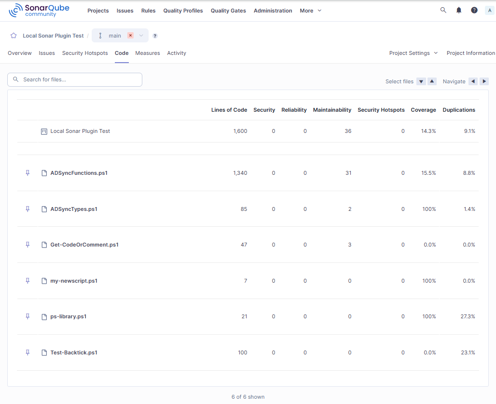

# sonarqube-powershell-plugin

* [What the Plugin does](#what-the-plugin-does)
* [Prerequisites](#prerequisites)
    * [Folder Structure](#folder-structure)
    * [Required Software](#required-software)
* [Installation](#installation)
* [Configuration](#configuration)
    * [Applies to all Versions](#applies-to-all-versions)
    * [Version 0.4.0+](#version-04)
* [Illustration](#illustration)
* [Version History](VERSION_HISTORY.md)

## What the Plugin does
- Runs Built-in PSScriptAnalyzer Rules and displays Findings in Code.
- PSScriptAnalyzer Rules can be loaded with more Details (Version 0.4.0). "Remediation Effort" and "Why is this an Issue" can be set per individual Rule. Dor every Issue, which can be matched bsed on the Test Name, these Infos are applied, for all other Rules, it falls back to the Behaviour of Version 0.3.0.
- Integrates custom PSScriptAnalyzer Rules the same way as it handles Built-in Rules. This Part can be turned on/off in SonarQube Administration.
- Runs Pester Tests and calculates and shows covered parts of the Code (and Code not covered). This Part can also be turned on/off in SonarQube Administration.
- Calculates and displays
    - Duplicate Code
    - Cyclomatic Complexity
    - Cognitive Complexity
    - Technical Debt
- Uses Code Highlighting to make the Scripts more readable.
- Produces a lot of Debug output if turned on in  SonarQube Administration.

This repository contains two different styles of a SonarQube Powershell Plugin.

Originally I was inspired by the [sonar-ps-plugin](https://github.com/gretard/sonar-ps-plugin) Powershell Plugin which I used for quite a while. And I really appreciate the work done. But it did not work anymore and I think it is mainly because of SonarQube changed the way Language definition is made in newer versions of the API.

Now it is:

```
public PowershellLanguage(final Configuration configuration)
```
compared to the old way:
```
public PowershellLanguage(final Settings settings)
```

Beside this, it has also outdated dependencies. But never the less, the folder "sonarqube-powershell-plugin/src/branch/main/sonar-ps-plugin" contains a working example of gretard's repo.

I started to re-write a new Plugin for the following reasons:
- First of all I wanted to understand what gretard code is actually doing. And I am now able to update the code on my own.
- I wanted to be compatible to the current API's.
- I use custom PSScriptAnalyzer rules and gretard's Plugin must be re-compiled and re-deployed for every new rule I want to use. In my project new rules can be used without any change in the current SonarQube configuration.
- I also wanted to integrate Pester Test results and Code Coverage from Pester Tests.

But there is a disadvantage which comes with the flexibility!
In gretard's implementation every rule is baked into the code at compile time. This allows to add much more information to rules. Unforunately SonarQube dos not allow to change the part "Why is this an issue" in the Sensor. At least I did not find a way yet.

I decided to have only 3 rules and every issue is matched to one of these rules based on Severity. I can add more custom PSScriptAnalyzer rules and their findings appear in SonarQube without the need to modify configuration files and re-compile the project.

# Prerequisites
## Folder Structure
In my projects I use this folder structure.
- 'project' is the root folder. It can be named as you like. This folder contains the files and folders to be scanned by PSScriptAnalyzer and Pester. Inclusions and exclusions are explained below.
- 'artifacts' is the folder for the files transferred to SonarQube at the end of the scan process. If it does not exist, it will be created.
- 'tests' folder contains the Pester test files.

The process also creates intermediate files. These files are located in the users %temp% folder.

```
project/
 -  artifacts/
 -  tests/
     - my-script-to-be-analyzed.Tests.ps1
 - sonar-project.properties
 - my-script-to-be-analyzed.ps1
 - my-module-to-be-analyzed.psm1

```

You can have more sub-folders and manage inclusions and exclusions in the properties file explained later.

## Required Software

| Plugin Version | PSScriptAnalyzer | Pester | Java | SonarQube |
| --- | --- | --- | --- | --- |
| 0.4.0 | 1.24.0 | 5.7.1 | 17+ | 26.1.0.118079 |


I run my Tests on Windows 11 (never tested it on Linux).

# Installation
## Applies to all Versions
To install the Plugin just copy the jar file to the 'downloads' folder of your SonarQube instance and restart SonarQube.
## Version 0.4+
These where my Goals for this Version:
| # | Goal | Mission accomplished |
| --- | --- | --- |
| 1 | Ability to add Rules without the need to re-compile the Project | ✅ |
| 2 | Ability to add Rules without to re-deploy the Plugin | ❌ |
| 3 | Ability to add more Details to Findings | ✅ |

Unfortunately it is not possible to hot-load Rules and keep the Ability to add more Details at the same Time. I had to decide either to load Rules dynamically or to have Information like "Why is this an Issue" and keep the SonarQube Measures.


To be able to import advanced Information per PSScriptAnalyser Rule, you must define a Path local to the SonarQube Server in the Settings of the Plugin. In a docker environment it could be like this:

```
volumes:
      - ./sonarqube/custom_extensions:/custom_extensions
```

This is the folder where you copy the Rules Definitions. It is one Definition File per Rule. A typical Definition might look like this:

/custom_extensions/PSAvoidUsingCmdletAliases.xml
~~~ XML
<rule>
  <key>PSAvoidUsingCmdletAliases</key>
  <description>Avoid Using Cmdlet Aliases or omitting the 'Get-' prefix.</description>
  <whyIsThisAnIssue>An alias is an alternate name or nickname for a cmdlet or for a command element, such as a function, script, file, or executable file. An implicit alias is also the omission of the 'Get-' prefix for commands with this prefix. But when writing scripts that will potentially need to be maintained over time, either by the original author or another Windows PowerShell scripter, please consider using full cmdlet name instead of alias. Aliases can introduce these problems, readability, understandability and availability.</whyIsThisAnIssue>
  <remediationFunction>LINEAR</remediationFunction>
  <debtRemediationFunctionLinearOffset/>
  <debtRemediationFunctionCoefficient>5min</debtRemediationFunctionCoefficient>
  <severity>MAJOR</severity>
 <ruleType>CODE_SMELL</ruleType>
</rule>
~~~

For every of these Files, a Rule is created and activated in SonarQube. Possible Values are explained in the following Table:
| XML Node Name | Value | Comment | Link |
| --- | --- | --- | --- |
| key | PSScriptAnalyzer Test Name | This Name must exactly match the Test Name reported by PSScriptAnaylzer when running Get-ScriptAnalyzerRule ||
| description | Can be every String | I recomment using the Description of the Get-ScriptAnalyzerRule output | |
| whyIsThisAnIssue | Can be every String | This appears in the "Why is this an Issue" part of the SonarQube GUI. ||
| remediationFunction |CONSTANT_ISSUE<br>LINEAR<br>LINEAR_OFFSET | Costs to fix this Issue. Example:<br>- Constant 5min: per Issue<br>- Linear 5min: but increasing with amount of Lines of Code<br>- LINEAR_OFFSET 2min/5min: 2min base + 5min per Issue | [DebtRemediationFunction.Type](https://javadoc.io/doc/org.sonarsource.sonarqube/sonar-plugin-api/latest/org/sonar/api/server/debt/DebtRemediationFunction.Type.html) |
| debtRemediationFunctionCoefficient | A Durations String | Used as Base for all 3 Types | [org.sonar.api.utils.Durations](https://javadoc.io/doc/org.sonarsource.sonarqube/sonar-plugin-api/latest/org/sonar/api/utils/Durations.html) |
| debtRemediationFunctionLinearOffset | A Durations String | Used tgether with DebtRemediationFunction.Type.LINEAR_OFFSET | |
| severity |BLOCKER<br>CRITICAL<br>INFO<BR>MAJOR<br>MINOR| Severity of the Issue | [org.sonar.api.batch.rule.Severity](https://javadoc.io/doc/org.sonarsource.sonarqube/sonar-plugin-api/latest/org/sonar/api/batch/rule/Severity.html)|
| ruleType | BUG<br>CODE_SMELL<br>SECURITY_HOTSPOT<br>VULNERABILITY| Type of the Issue| [org.sonar.api.rules.RuleType](https://javadoc.io/doc/org.sonarsource.sonarqube/sonar-plugin-api/latest/org/sonar/api/rules/RuleType.html)|

To deploy Rules (new or additional or updated)
1. Add or update Rule Files
2. Copy the Plugin.jar File to the download Folder (again, like for the first Setup, you can use the same File)
3. Use Marketplace and remove the installed Plugin
4. Restart SonarQube.
This is the only Way to load Rules in the SonarQube Database.

# Configuration
You can configure the Plugin in SonarQube GUI or you can set it the sonar-project.properties file.

You have to set these options with project related values
- sonar.organization
- sonar.projectName
- sonar.projectKey
- sonar.host.url
- sonar.token


The following options might be important to run the plugin depending on your project:

| # | Option | Vaule | Description |
| --- | ---- | --- | ---- |
| 1 | sonar.sourceEncoding | UTF-8 | files are UTF-8 encoded |
| 2 | sonar.sources | . | working directory is the current folder |
| 3 | sonar.language | powershell | must be "powershell" to trigger the plugin |
| 4 | sonar.lang.patterns.powershell | \*\*/\*.ps1,**/*.psm1  | regex which defines the files which should be assined to the language 'powershell' |
| 5 | sonar.inclusions | \*\*/\*.ps1,**/*.psm1 | regex which defines files should be analyzed |
| 6 | sonar.exclusions | artifacts/**,tests/*.Tests.ps1 | files and folders which should be excluded from scan |
| 7 | sonar.dynamicAnalysis | reuseReports | |
| 8 | sonar.tests | tests | the folder where test files for Pester tests are stored |
| 9 | sonar.testExecutionReportPaths | artifacts/PesterExecutionReport.xml | I have a "artifacts" folder where reports are stored before they are transmitted to Sonarqube. The filename is currently hardcoded. Used only with Pester. |
| 10 | sonar.coverageReportPaths | artifacts/SonarCodeCoverage.xml | Same as testExecutionReportPaths. Used only with Pester |
| 11 | sonar.dependencyCheck.skip | true | there is no dependency check |
| 12 | sonar.scm.disabled | true | |
| 13 | sonar.projectVersion | 0.9.001 | you can set every version you like |
| 14 | sonar.verbose | true | determines the amount of output Sonarqbube produces during the scan |
| 15 | psscriptanalyzer.customrules.path | c:\dev\PSScriptAnalyzerRules\\*.psm1 | folder containing custom rules for PSScriptanalyzer. This is NOT used if the follwoing option is set to false |
| 16 | psscriptanalyzer.customrules.enabled | true | determines if custom rules are used to analyze the scripts |
| 17 | psscriptanalyzer.defaultrules.enabled | true | can be used to only run custom rules and ignore the PSScriptanalyzer default rules |
| 18 | psscriptanalyzer.debugoutput.enabled | false | produces a lot more output during scan when set to true |
| 19 | psscriptanalyzer.exclude.rule | | A comma-seperated list of PSScriptAnalyzer Rule Names that will be skipped |
| 20 | psscriptanalyzer.pester.enabled | true | runs Pester after PSScriptAnalyzer has finished |
| 21 | sonar.jacoco.reportPaths | artifacts | folder where SonarQube expects file with scan results |
| 22 | sonar.jacoco.xmlReportPaths | artifacts | same as 21 |
| 23 | sonar.java.coveragePlugin | jacoco | Plugin used for code analysis |
| 24 | sonar.cpd.powershell.minimumLines | | number of duplicated lines which raise a problem in duplication detection |
| 25 | sonar.cpd.powershell.minimumTokens | | number of duplicated tokens which raise a problem in duplication detection |
| 26 | sonar.web.maxContentLength | | max. size of content length which can be transferred to SonarQube. |
| 27 | sonar.max.file.size | | max file size of result files transferred to SonarQube |

Settings starting with 'psscriptanalyzer' can also set SonarQube GUI

Administration -> Configuration -> PSScriptAnalyzer

# Illustration
Here are a few pictures of my running instance.
## Code highlighted for readability


## Overview of Findings and Numbers per File

## PSScriptAnalyzer Finding in Detail

## Complexity

## File Size

## Duplicate Code Overview

## Duplicate Code in Detail

## Code Coverage

## Maintainablility

## Plugin Settings

